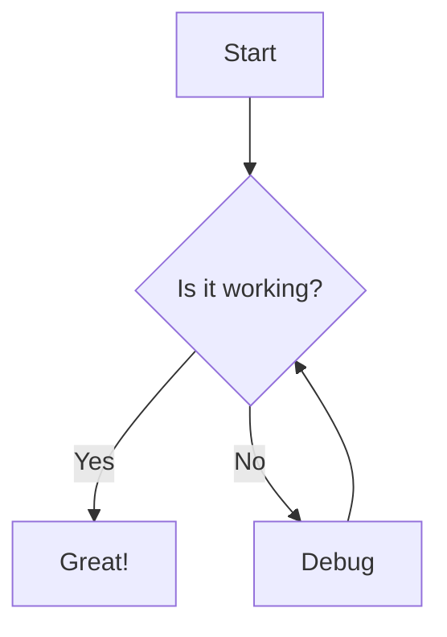
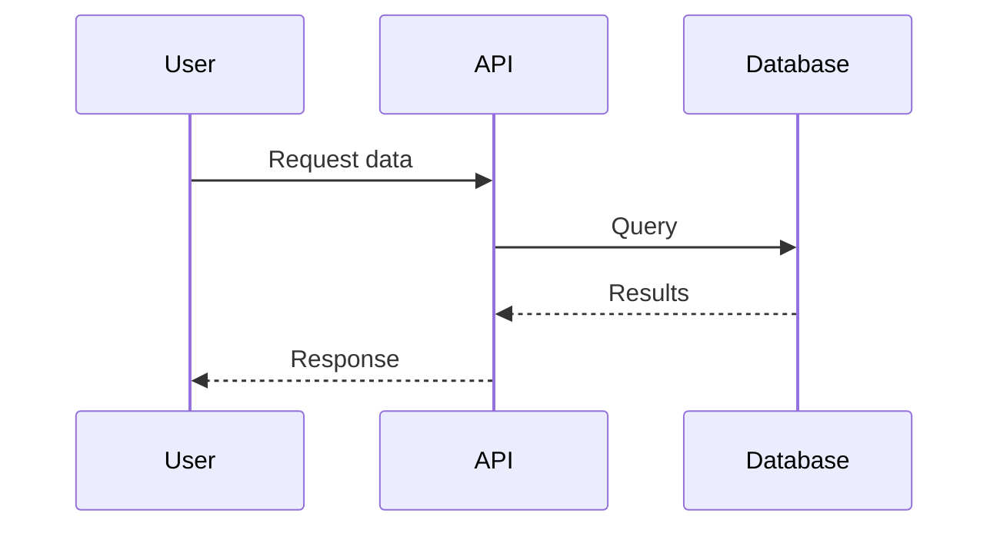

This is a **test blog post** designed to showcase all markdown formatting options. Use this to verify your markdown renderer handles everything correctly.

## Headings

# Heading 1
## Heading 2
### Heading 3
#### Heading 4
##### Heading 5
###### Heading 6

---

## Text Formatting

This is **bold text** and this is *italic text*.

You can also use __bold__ and _italic_ with underscores.

Here's ***bold and italic*** combined.

This is ~~strikethrough~~ text.

This is `inline code` within a paragraph.

---

## Links and Images

Here's a [link to Google](https://www.google.com).

Here's an [internal link](/blog) to the blog page.

Here's an automatic URL: https://www.example.com


---

## Lists

### Unordered Lists

- Item 1
- Item 2
  - Nested item 2.1
  - Nested item 2.2
    - Deeply nested item
- Item 3

Alternative syntax:

* Asterisk item 1
* Asterisk item 2

### Ordered Lists

1. First item
2. Second item
   1. Nested numbered item
   2. Another nested item
3. Third item

### Mixed Lists

1. First ordered item
   - Unordered sub-item
   - Another sub-item
2. Second ordered item
   1. Ordered sub-item
   2. Another ordered sub-item

### Task Lists (Checkboxes)

- [x] Completed task
- [x] Another completed task
- [ ] Incomplete task
- [ ] Another incomplete task

---

## Blockquotes

> This is a blockquote.

> This is a multi-paragraph blockquote.
>
> It continues here with more text.

> Nested blockquotes:
>> This is nested inside the first quote.
>>> And this is even more deeply nested.

> **Formatted text** inside a blockquote with a [link](https://example.com).

---

## Code Blocks

### Inline Code

Use `const x = 5` for inline code snippets.

### Fenced Code Blocks (No Language)

```
This is a plain code block
with no syntax highlighting.
```

### JavaScript

```javascript
function greet(name) {
  const message = `Hello, ${name}!`;
  console.log(message);
  return message;
}

// Arrow function example
const add = (a, b) => a + b;

// Async/await example
async function fetchData(url) {
  try {
    const response = await fetch(url);
    const data = await response.json();
    return data;
  } catch (error) {
    console.error('Error:', error);
  }
}
```

### TypeScript

```typescript
interface User {
  id: number;
  name: string;
  email: string;
  isActive?: boolean;
}

type Status = 'pending' | 'approved' | 'rejected';

function processUser(user: User): string {
  return `Processing ${user.name}`;
}

const users: User[] = [
  { id: 1, name: 'Alice', email: 'alice@example.com' },
  { id: 2, name: 'Bob', email: 'bob@example.com', isActive: true },
];
```

### Python

```python
def calculate_average(numbers: list[float]) -> float:
    """Calculate the average of a list of numbers."""
    if not numbers:
        return 0.0
    return sum(numbers) / len(numbers)

# List comprehension
squares = [x**2 for x in range(10)]

# Dictionary comprehension
word_lengths = {word: len(word) for word in ['apple', 'banana', 'cherry']}

# Class example
class DataProcessor:
    def __init__(self, data):
        self.data = data

    def process(self):
        return [item.upper() for item in self.data]
```

### HTML

```html
<!DOCTYPE html>
<html lang="en">
<head>
  <meta charset="UTF-8">
  <meta name="viewport" content="width=device-width, initial-scale=1.0">
  <title>Sample Page</title>
</head>
<body>
  <header>
    <h1>Welcome</h1>
    <nav>
      <a href="/">Home</a>
      <a href="/about">About</a>
    </nav>
  </header>
  <main>
    <p>Hello, World!</p>
  </main>
</body>
</html>
```

### CSS

```css
:root {
  --primary-color: #3498db;
  --secondary-color: #2ecc71;
  --font-size-base: 16px;
}

.container {
  max-width: 1200px;
  margin: 0 auto;
  padding: 1rem;
}

.button {
  background-color: var(--primary-color);
  color: white;
  padding: 0.5rem 1rem;
  border: none;
  border-radius: 4px;
  cursor: pointer;
  transition: background-color 0.3s ease;
}

.button:hover {
  background-color: darken(var(--primary-color), 10%);
}
```

### JSON

```json
{
  "name": "project-name",
  "version": "1.0.0",
  "description": "A sample project",
  "dependencies": {
    "react": "^18.2.0",
    "next": "^14.0.0"
  },
  "scripts": {
    "dev": "next dev",
    "build": "next build"
  },
  "keywords": ["sample", "test", "demo"],
  "author": {
    "name": "John Doe",
    "email": "john@example.com"
  }
}
```

### Bash / Shell

```bash
#!/bin/bash

# Variables
NAME="World"
echo "Hello, $NAME!"

# Loop example
for i in {1..5}; do
  echo "Iteration $i"
done

# Conditional
if [ -f "file.txt" ]; then
  echo "File exists"
else
  echo "File not found"
fi

# Function
greet() {
  echo "Hello, $1!"
}
greet "User"
```

### SQL

```sql
-- Create table
CREATE TABLE users (
  id SERIAL PRIMARY KEY,
  name VARCHAR(100) NOT NULL,
  email VARCHAR(255) UNIQUE NOT NULL,
  created_at TIMESTAMP DEFAULT CURRENT_TIMESTAMP
);

-- Insert data
INSERT INTO users (name, email)
VALUES ('Alice', 'alice@example.com');

-- Query with JOIN
SELECT u.name, o.total
FROM users u
INNER JOIN orders o ON u.id = o.user_id
WHERE o.status = 'completed'
ORDER BY o.total DESC
LIMIT 10;
```

### YAML

```yaml
version: '3.8'
services:
  web:
    image: nginx:latest
    ports:
      - "80:80"
    volumes:
      - ./html:/usr/share/nginx/html
    environment:
      - NGINX_HOST=localhost
      - NGINX_PORT=80
    depends_on:
      - api

  api:
    build: ./api
    environment:
      DATABASE_URL: postgres://user:pass@db:5432/mydb
    restart: unless-stopped
```

---

## Tables

### Simple Table

| Header 1 | Header 2 | Header 3 |
|----------|----------|----------|
| Cell 1   | Cell 2   | Cell 3   |
| Cell 4   | Cell 5   | Cell 6   |
| Cell 7   | Cell 8   | Cell 9   |

### Aligned Table

| Left Aligned | Center Aligned | Right Aligned |
|:-------------|:--------------:|--------------:|
| Left         | Center         | Right         |
| Text         | Text           | Text          |
| More         | More           | More          |

### Complex Table

| Feature | Free Plan | Pro Plan | Enterprise |
|:--------|:---------:|:--------:|:----------:|
| Users | 1 | 10 | Unlimited |
| Storage | 5 GB | 100 GB | 1 TB |
| Support | Email | Priority | 24/7 Phone |
| Price | $0/mo | $29/mo | Custom |

---

## Horizontal Rules

Three different ways to create horizontal rules:

---

***

___

---

## Line Breaks and Paragraphs

This is the first paragraph. It has multiple sentences. Lorem ipsum dolor sit amet, consectetur adipiscing elit.

This is the second paragraph, separated by a blank line. Ut enim ad minim veniam, quis nostrud exercitation.

This line has a hard break at the end
And this continues on the next line (two spaces before the line break).

---

## Special Characters and Escaping

To display literal characters that have special meaning in markdown:

\*Not italic\*

\*\*Not bold\*\*

\# Not a heading

\[Not a link\](url)

Ampersand: &

Less than: <

Greater than: >

---

## HTML Elements (If Supported)

<details>
<summary>Click to expand</summary>

This content is hidden by default and reveals when you click the summary.

- Hidden item 1
- Hidden item 2
- Hidden item 3

</details>

<mark>This text is highlighted</mark>

<kbd>Ctrl</kbd> + <kbd>C</kbd> to copy

<sub>subscript</sub> and <sup>superscript</sup>

<abbr title="HyperText Markup Language">HTML</abbr>

---

## Footnotes (If Supported)

Here's a sentence with a footnote.[^1]

Here's another sentence with a different footnote.[^2]

[^1]: This is the first footnote content.
[^2]: This is the second footnote content with more details.

---

## Definition Lists (If Supported)

Term 1
: Definition for term 1

Term 2
: Definition for term 2
: Alternative definition for term 2

---

## Emoji (If Supported)

:smile: :rocket: :thumbsup: :heart: :star:

Or use actual Unicode emoji: 🎉 ✅ 🚀 💡 ⚡

---

## Mathematical Notation (If Supported)

Inline math: $E = mc^2$

Block math:

$$
\sum_{i=1}^{n} x_i = x_1 + x_2 + \cdots + x_n
$$

$$
f(x) = \int_{-\infty}^{\infty} \hat{f}(\xi) e^{2\pi i \xi x} d\xi
$$

---

## Mermaid Diagrams (If Supported)





---

## Summary

This test post covers:

1. **Text formatting**: Bold, italic, strikethrough, inline code
2. **Headings**: All 6 levels
3. **Lists**: Ordered, unordered, nested, task lists
4. **Links and images**: Various link types
5. **Blockquotes**: Simple and nested
6. **Code blocks**: Multiple languages with syntax highlighting
7. **Tables**: Simple, aligned, and complex
8. **Horizontal rules**: Different syntaxes
9. **Special elements**: HTML, footnotes, emoji, math, diagrams

Use this post to verify your markdown rendering is working correctly!
